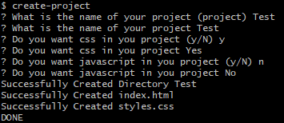
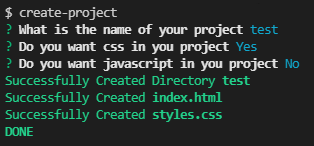

# Project Generator

> Generate Basic Projects Faster

## Installation

```shell
$ npm install -g project-generator
```

## Usage

To generate a project type

```shell
$ project-generator
```
or
```shell
$ create-project
```
----------

Then It Will Ask you some questions.



With color.



It's bit different because of different terminals.

> ***Note:*** *It generates a folder with the name you gave, not only the files*